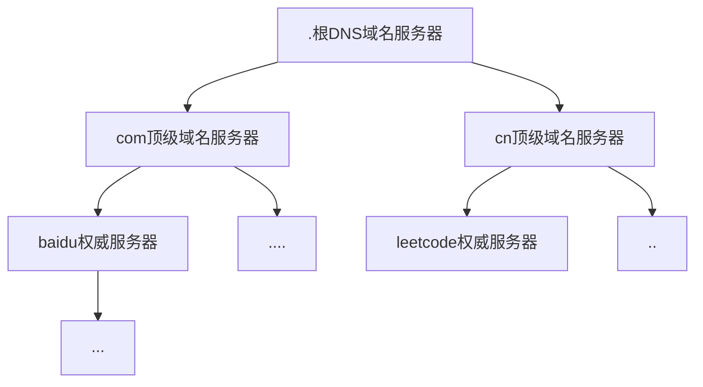

# 计算机网络

## 计算机网络基础架构

1. 应用层

   1. 任务

      在应用中提供网络服务，并利用网络API接口对应用数据进行传输处理

   2. 传输单位（消息或报文）

2. 传输层

   1. 任务

      为「应用层」提供**网络设备应用到网络设备应用**支持的，规定了端口来区分主机中的应用，并提供协议来规定数据该如何传输，TCP在此处提供了基于面向字节流、流量控制、超时重传、拥塞控制，来提供可靠传输

   2. 传输单位（段）

3. 网络层

   1. 任务

      为「传输层」提供了**网路设备到网络设备通讯**的支持，让数据能够在错综复杂的网络结构中进行传输

   2. 传输单位（包）

4. 数据链路层

   1. 任务

      为「网络层」提供了**多个相连的设备之间通讯**的支持

   2. 传输单位（帧）

5. 物理层

   1. 任务

      为「数据链路层」提供了将**二进制数据转变为信号**进行传输的支持

   2. 传输单位（比特流）


## 在浏览器中输入URL访问网页时发生了什么

### 浏览器对URL解析

https://baike.baidu.com/item/TCP/33012

| https    | ://              | baike.baidu.com | /item/TCP/33012 |
| -------- | ---------------- | --------------- | --------------- |
| 协议名称 | 分隔协议和主机名 | 服务器名称      | 文件目录或路由  |

### 生成请求报文

通过curl来模拟对一个网页进行请求的过程

```bash
curl -v www.baidu.com
```

得到发送的请求报文

```
GET / HTTP/1.1
Host: www.baidu.com
User-Agent: curl/8.1.2
Accept: */*
```

### 域名的地址查询

DNS 中的域名都是用**句点**来分隔的，比如 `www.baike.baidu.com`，这里的句点代表了不同层次之间的**界限**

在域名中，域名层级是**从右向左**逐层递减的

域名的层级关系类似一个树状结构



处理过程

1. 向浏览器，操作系统，host文件的缓存中查询关于此域名的信息，若有则返回地址给处理程序
2. 向本地域名服务器发送请求，在缓存中查询关于此域名的信息
3. 本地域名服务器若查到则返回信息给主机
4. 若查不到此信息则向根域名服务器发送请求，根域名服务器根据域名返回顶级域名服务器的地址
5. 主机向顶级域名服务器发送请求，顶级域名服务器根据域名返回权威服务器的地址
6. 主机向权威服务器中发送请求，权威服务器根据域名返回目标IP

### 数据在运输层的可靠传输TCP

在传输之前，TCP会将报文根据MSS最大报文段长度来分割报文，作为一个段，并在该段上加上TCP首部，首部中的源端口号设置为请求程序所使用的端口号，目的端口号会自动设置为80（HTTP协议）或443（HTTPS协议）

### 数据在网络层中的定位服务

每个数据报文段上会再附加IP首部，其中包含了源IP和目的IP，计算机和路由中的路由表会根据目的IP得到下一跳的接口，并由该接口来发送数据，在层层转发中，数据将给到目的网络设备

### 数据在设备与设备中的两点传输

每个数据报文包上会再附加MAC帧首部，MAC首部包含了源物理地址和目的物理地址，在数据发送出去之后，通过物理地址，目的设备知道自己是否可以接受该报文

### 数据从设备中发出

层层封装的数据通过网卡进行传输，网卡会将这些二进制数据转化为信号并发送出去

### 交换机

当交换机收到来自某一主机设备发送的电信号后，会将其转换为数字信号，根据FCS校验序列查看该数据是否被破坏，若被破坏，则丢弃该数据，若没有，交换机会根据交换机内部映射表来查看数据要从哪个接口中发送出去

如果交换机内部映射表找不到目的MAC地址，那么他会将数据从除了源MAC地址外所有的接口广播出去

当交换机收到一个数据帧但是源MAC地址没有在映射表中，那么交换机会记录该MAC地址并和收到的接口绑定在一起

### 路由器

路由器在收到数据包之后，会提取出数据包的目的IP地址，并将该目的地址与内部路由表进行匹配，来查看目的地址所属的网络，匹配成功后根据接口发送数据

如果从路由表中找不到，那么从默认路由中进行发送

在发送的过程中，数据中的源MAC地址到目的MAC地址在不断的变更（路由器相当于网络设备，因为需要 MAC 地址在以太网内进行**两个设备**之间的包传输），而源IP和目的IP不会改变

### 浏览器解析

在通过这些协议栈之后，客户端的请求报文得以发送到目的服务器，目的服务器也通过这些协议栈，将响应报文发送给客户端，客户端浏览器根据响应报文的超文本内容，将其显示在浏览器页面上

